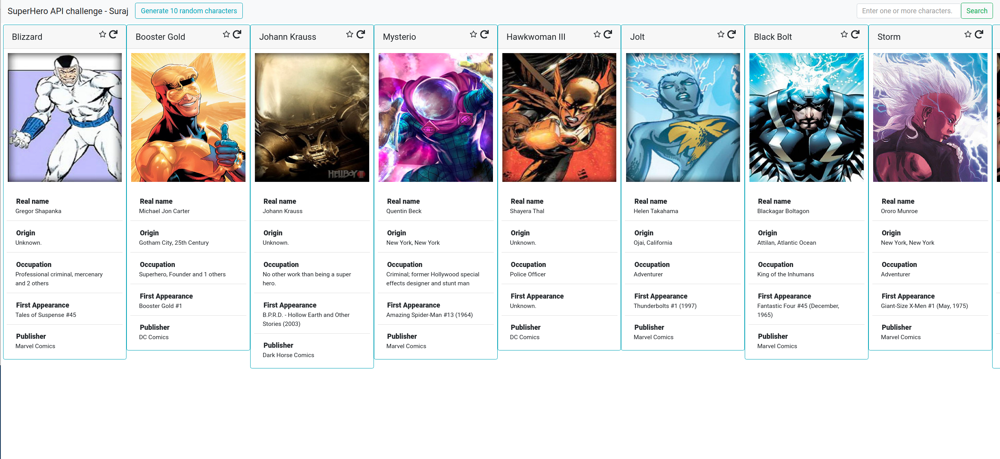
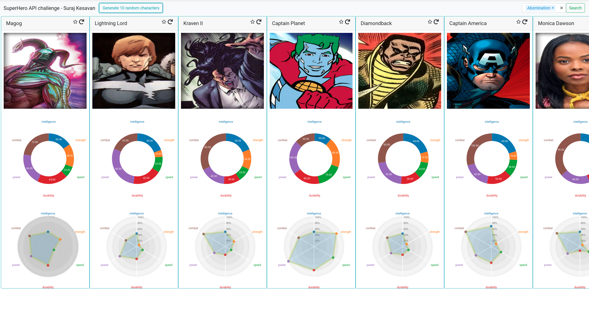

# React hooks example application.

This project is an example prototype application that I created to learn some concepts of react hooks. The application fetches data from the [SuperHeroAPI](https://superheroapi.com/) and provides a visual interface to reveal the information belonging to a selected superhero. This project can also be used as a starter code for projects that would like to use react hooks. 

Some of the features: 
1. Integration with socket API using flask. 
2. Usage of react's useContext, useState to create different contexts for the views. 
3. Usage of styled components for styling different components.
4. Form with data completion. 
5. Visualizations using sunburts plots, and radar plots to display the superhero's powers. 

## Interface 

***Front Card view***


***Back Card view***



## Installation

``` bash
    yarn install
    pip3 install -r requirements.txt
```

## Update the token for access to SuperHero API.

1. Create a token.txt file.
2. Open the token.txt file and update it with your private token key.

## To run the server

``` bash
   cd server
   python3 app.py
```

## To run the client

``` bash
   cd ..
   yarn start
```

Useful links to learn React hooks.

1. <https://frontarm.com/james-k-nelson/hooks-vs-render-props/>
2. <https://usehooks.com/>
3. <https://frontarm.com/james-k-nelson/usecontext-react-hook/>
4. <https://medium.com/stationfive/how-to-create-a-pie-chart-with-d3-js-and-react-hooks-part-1-81bcd7f39b32>
5. <https://medium.com/@alexboots/using-react-context-with-socket-io-3b7205c86a6d>
6. <https://medium.com/stationfive/how-to-create-a-pie-chart-with-d3-js-and-react-hooks-part-1-81bcd7f39b32>

## Issues

***Incosistent Card sizes.***
Card heights depend on how much text is being displayed. This leads to inconsistent card sizes. 

***Arctween does not work always.*** There is some weird state management error
that sets NaN to `prevData` and sometimes arctween does not really work. 

***Flip card button not integrated completely.*** I used a button to flip all
the cards simultenously due to lack of time. I was initially planning to set
state for each card and the user can choose which card to flip. 

***Target superhero needs to specified manually.*** Current code assumes that we
are always comparing with the super hero in the index 0 of
`currentCharacterList`. My initial goal was to integrate click on the star
button to add the powerstats to all the `radarCharts`.

***Parsing the powerstats not done correct.*** Some characters have null values
for the powerstats and needs to be preprocessed before visualization. 

***Organization for the Character component*** Since this was the last component
I worked on the code looks pretty unorganized, I apologize for that. I would
have to abstract the Cards into `FrontCard` and `BackCard`, separate the styles
to a new file, and separate the parsing of fields. 